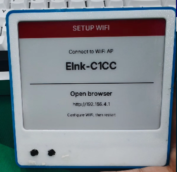
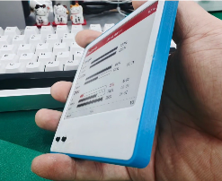
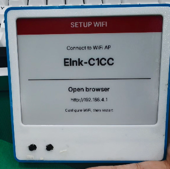
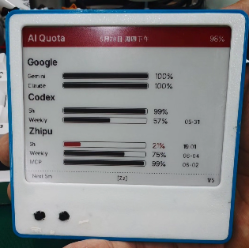
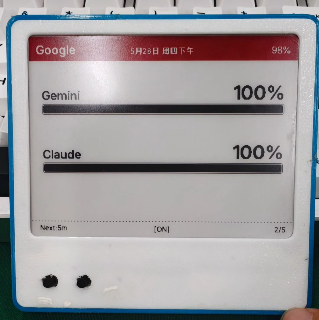
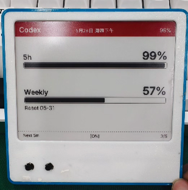
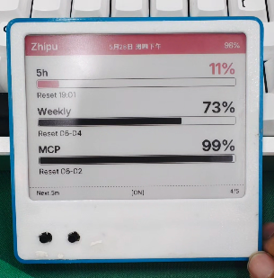
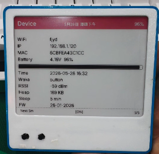
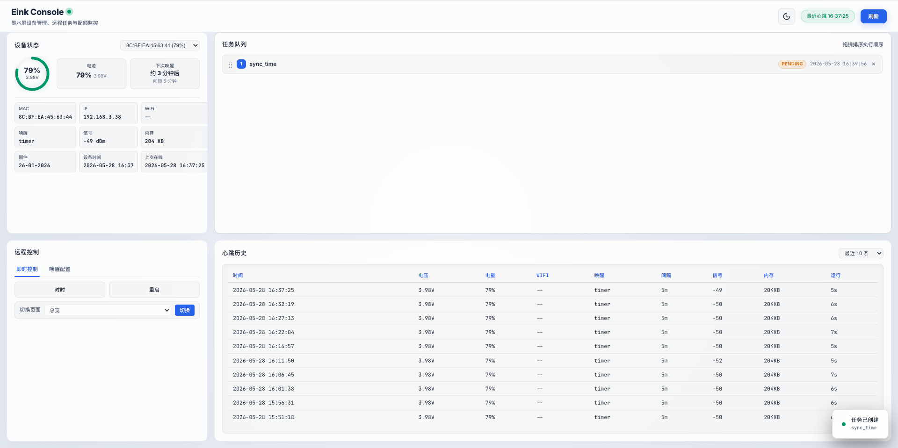

# 墨鱼AI墨水屏 - 大模型配额看板

ESP32-C3 低功耗电子墨水屏，每 5 分钟自动唤醒，直连配额服务拉取 Gemini (Antigravity) / Codex / 智谱的大模型配额并显示。

  

```
┌──────────────┐    直连     ┌──────────────┐
│  ESP32 墨水屏 │ ◄────────── │  quota_go    │
│  配额看板     │             │  :12001      │
└──────┬───────┘             └──────────────┘
       │ 心跳/任务（可选）
       ▼
┌──────────────┐   WebSocket  ┌──────────────┐
│ smart_control │ ◄────────── │  浏览器       │
│   :9857      │   Dashboard  │  Dashboard   │
└──────────────┘              └──────────────┘
```

> 智控台为可选组件，不部署不影响设备正常使用。
> 需要自己编译？请看 [BUILD.md](BUILD.md)

---

## 实物展示

<table>
<tr>
<td><br/>正面</td>
<td><br/>侧面</td>
<td><br/>配网页</td>
<td><br/>总览页</td>
</tr>
<tr>
<td><br/>Google 配额</td>
<td><br/>Codex 配额</td>
<td><br/>智谱配额</td>
<td><br/>设备信息</td>
</tr>
<tr>
<td colspan="4" align="center"><br/>智控台首页</td>
</tr>
</table>

## 硬件采购

| 组件 | 规格 | 链接 |
|------|------|------|
| 一体主板 | 墨鱼AI墨水屏开源主板 | [立创开源硬件平台](https://oshwhub.com/qq173972819/project_mqihrlpc) |
| 外壳 | 8.5mm 超薄 3D 打印外壳 | [MakerWorld](https://makerworld.com.cn/zh/models/2462959-inksight4-2cun-mo-shui-ping-wai-ke-chao-bo-8-5mm-j#profileId-2811712) |
| 电池 | 504080 锂电池，接头备注 **1.0 黑红** | 淘宝搜"504080 锂电池" |
| 屏幕 | **WFT0420CZ15**（4.2 寸三色 400x300），也支持 GDEY042T81 | 淘宝/立创商城 |
| FPC 软排线 | 5cm、24pin、同向 FPC 软排线 | 淘宝搜索购买 |
| FPC 连接器 | 24pin FPC 连接器 | 淘宝搜索购买 |
| USB 数据线 | 用于烧录固件和供电 | 需支持数据传输，非纯充电线 |

> 增加 FPC 软排线和连接器是因为原主板与屏幕自带排线较短，直接连接时外壳可能合不上。

---

## 从 Release 部署

到 [Releases](../../releases) 页面下载对应平台文件：

| 文件 | 用途 |
|------|------|
| `firmware-wft0420cz15.bin` | 三色屏固件（WFT0420CZ15） |
| `firmware-gdey042t81.bin` | 黑白屏固件（GDEY042T81） |
| `quota_checker_linux_amd64` | Linux x86 配额服务 |
| `quota_checker_linux_arm64` | Linux ARM 配额服务（树莓派/NAS） |
| `quota_checker_darwin_arm64` | macOS Apple Silicon 配额服务 |
| `quota_checker_windows_amd64.exe` | Windows 配额服务 |
| `elnk-console-linux-amd64.tar.gz` | Linux 智控台（可选） |
| `elnk-console-darwin-arm64.tar.gz` | macOS 智控台（可选） |

---

## 第一步：刷入固件

### 1. 安装烧录工具

```bash
pip install platformio
```

或安装 VSCode PlatformIO 插件。

### 2. 烧录

用 USB 数据线连接设备和电脑。从 Release 下载对应的 `.bin` 固件文件后：

```bash
# 安装烧录工具
pip install esptool

# 查看可用串口
python -m serial.tools.list_ports

# 烧录（替换为你的串口设备和固件文件）
python -m esptool --chip esp32c3 --port /dev/ttyUSB0 --baud 460800 \
  write_flash -z 0x0 firmware-wft0420cz15.bin
```

> macOS 串口通常是 `/dev/tty.usbmodem*`，Windows 根据设备管理器中显示的实际 COM 口选择。
> Release 里的 `firmware-*.bin` 是合并后的单文件固件，按 `0x0` 地址烧录即可；从源码编译上传请看 [BUILD.md](BUILD.md)。
> 烧录失败时：按住 BOOT 键 → 点按 EN 键 → 松开 EN → 松开 BOOT → 重新烧录。

### 3. 确认固件运行

```bash
pio device monitor -b 115200
```

看到启动日志输出说明固件运行正常，按 `Ctrl+]` 退出。

---

## 第二步：部署配额服务 (quota_go)

配额服务是一个独立的 HTTP API，查询 Gemini (Antigravity) / Codex / 智谱的大模型用量并返回轻量 JSON。**即使不做墨水屏设备，也可以单独部署为其他项目提供配额查询接口**——比如接入你自己的 Dashboard、机器人、通知系统等。

特性：

- **自动刷新短效 Token**：OAuth 登录获取长效 refresh_token 后，服务自动用其换取短效 access_token（约 1 小时过期）。每次查询前检查过期时间，过期则自动刷新；遇到 401 也会立即刷新重试，全程无需人工干预
- **多端点降级**：Gemini (Antigravity) 配置了 3 个 API 端点，主端点不可用时自动切换到备用端点
- **内存 + 文件双层缓存**：减少对外部 API 的请求频率，可配置缓存时间（`cache_ttl`）
- **查询失败推送通知**：可配置 Server酱 sendkey，token 失效或服务异常时推送消息

> 查询 Gemini (Antigravity) 和 Codex 额度需要**服务器能访问外网**（Google / OpenAI 服务）。智谱使用国内 API，无此要求。

### 1. 上传并配置

```bash
# 创建目录
sudo mkdir -p /opt/elnk-quota
cd /opt/elnk-quota

# 上传从 Release 下载的二进制（改名为 quota_checker）
chmod +x quota_checker
```

配置文件需要从模板复制：

```bash
# 从 Release 下载的包里已包含 .config.example.json
# 如果是从源码部署，模板在 backend/quota_go/.config.example.json
cp .config.example.json .config.json
```

编辑 `.config.json`，填写必要字段：

```json
{
  "port": 12001,
  "server_path": "/LimiT/quErY",
  "cache_ttl": 600,
  "zhipu": {
    "api_key": "在此填入您的智谱 API Key"
  },
  "notify": {
    "sendkey": ""
  }
}
```

### 2. 配置说明

| 字段 | 说明 | 是否必填 |
|------|------|---------|
| `zhipu.api_key` | 智谱平台 API Key（[获取地址](https://open.bigmodel.cn/)） | **必填** |
| `port` | 监听端口，默认 `12001` | 有默认值 |
| `server_path` | HTTP 接口路径，按需自定义（如改为 `/api/quota`），配网时填写的额度查询地址需与此一致 | 有默认值 |
| `cache_ttl` | 配额数据缓存时间（秒），默认 600（10 分钟）。值越小刷新越频繁但请求越多 | 有默认值 |
| `gemini.*` | 固定 OAuth 指纹，**无需修改** | 不用管 |
| `codex.*` | 固定 OAuth 指纹，**无需修改** | 不用管 |
| `notify.sendkey` | [Server酱3](https://sc3.ft07.com/) 推送 key，查询失败时推送通知，为空不推送 | 选填 |

### 3. 大模型 OAuth 登录

首次使用需要完成 OAuth 登录获取 refresh_token。OAuth 授权实现参考了 [CLIProxyAPI](https://github.com/router-for-me/CLIProxyAPI)（Codex）和 [Antigravity-Manager](https://github.com/lbjlaq/Antigravity-Manager/)（Gemini）。

**Codex (OpenAI) 登录：**

```bash
./quota_checker login codex
```

1. 终端输出一个 URL → 复制到浏览器打开
2. 用 OpenAI 账号登录授权
3. 浏览器跳转到 `http://localhost:1455/auth/callback?code=...`（页面打不开是正常的）
4. **复制浏览器地址栏的完整 URL**，粘贴到终端，回车
5. 看到 `✓ 认证成功!` 即完成

**Gemini (Antigravity) 登录：**

```bash
./quota_checker login gemini
```

同样的流程：复制 URL → 浏览器登录 Google → 复制回调地址 → 粘贴到终端。

**智谱 (Zhipu)：** 不需要登录，在 `.config.json` 填入 API Key 即可。

### 4. 启动服务

```bash
./quota_checker server start
```

验证：

```bash
curl http://localhost:12001/LimiT/quErY
```

返回 JSON 数组即正常：

```json
[
  {"p":"gemini","gm":100,"gmr":"21:55","cl":100,"clr":"21:55"},
  {"p":"codex","h5":99,"h5r":"21:50","w":89,"wr":"05-25"},
  {"p":"zhipu","h5":46,"h5r":"19:51","w":60,"wr":"05-21","mcp":99,"mcpr":"06-02"}
]
```

### 5. 开机自启（推荐）

创建 systemd 服务：

```bash
sudo tee /etc/systemd/system/elnk-quota.service << 'EOF'
[Unit]
Description=eInk Quota Service
After=network.target

[Service]
Type=forking
WorkingDirectory=/opt/elnk-quota
ExecStart=/opt/elnk-quota/quota_checker server start
ExecStop=/opt/elnk-quota/quota_checker server stop
Restart=on-failure

[Install]
WantedBy=multi-user.target
EOF

sudo systemctl enable elnk-quota
sudo systemctl start elnk-quota
```

---

## 第三步：设备 WiFi 配网

固件刷入后，首次启动自动进入配网模式（屏幕显示 `SETUP WIFI`）。

### 操作步骤

1. 手机连接 WiFi 热点 `Elnk-XXXXX`
2. 浏览器自动弹出配网页面（或手动访问 `http://192.168.4.1`）
3. 填写以下信息：

| 字段 | 说明 | 是否必填 |
|------|------|---------|
| WiFi 名称 | 路由器 SSID | **必填** |
| WiFi 密码 | 支持留空（开放 WiFi） | 选填 |
| 额度查询地址 | `http://你的服务器IP:12001/LimiT/quErY` | **必填** |
| 更新间隔 | 自动刷新间隔，默认 5 分钟 | 有默认值 |
| 启用智控台 | 勾选后填写智控台地址 | 选填 |

4. 点击"连接并保存"，设备连接成功后自动重启

### 重新配网

- 开机时 **按住按键不放**，直到屏幕出现 `SETUP WIFI`
- 正常运行中 **长按按键 8 秒**
- WiFi 连接失败也会自动进入配网

> 配网页面会回显已保存的配置，修改想改的项，不想改的留空（密码自动复用旧密码）。

> 设备只支持 **2.4GHz** WiFi，不支持 5GHz。

---

## 第四步：使用按键操作

设备只有一个按键，通过按压时长区分操作：

| 操作 | 效果 |
|------|------|
| 短按（< 1.2 秒） | 切换页面：总览 → Google → Codex → 智谱 → 设备信息 |
| 长按 2 秒 | 手动刷新当前页数据（有变化才刷屏，无变化 LED 快闪 3 次） |
| 长按 8 秒 | 进入 WiFi 配网模式 |
| 开机按住 | 强制进入 WiFi 配网模式 |

### 屏幕唤醒与休眠

- **定时唤醒**：每隔设定间隔自动唤醒，联网拉取配额，刷屏后立即休眠。屏幕底部显示 `[Zz]`。
- **按键唤醒**：短按按键进入交互模式，可切页或手动刷新。30 秒无操作自动休眠，底部从 `[ON]` 切回 `[Zz]`。

### 状态栏说明

| 标识 | 含义 |
|------|------|
| `[Zz]` | 休眠态 — 深度睡眠中，定时器到期自动唤醒 |
| `[ON]` | 运行态 — 活跃交互中，30 秒无操作后休眠 |
| `Sleep:5m` | 休眠间隔，多久唤醒一次 |
| 右侧数字 | 当前页面编号（共 5 页） |

---

## 第五步（可选）：部署智控台 (smart_control)

智控台是一个可选的 Web Dashboard，用于远程管理多台设备。不部署完全不影响墨水屏正常使用。

功能：

- 查看多台设备的实时状态：电池电压、电量、连接 WiFi 名称、信号强度、固件版本
- 自定义全天时段休眠时间（如工作时间 5 分钟刷新、夜间 30 分钟刷新）
- 下发远程任务：切换显示页面、重启设备、触发校时

```bash
# 解压
sudo mkdir -p /opt/elnk-console
tar -xzf elnk-console-linux-amd64.tar.gz -C /opt/elnk-console
cd /opt/elnk-console

# 启动
./elnk-console server start
```

默认监听 `0.0.0.0:9857`，浏览器打开 `http://你的IP:9857` 即可看到 Dashboard。

> 详细配置（环境变量、nginx 反代、systemd）见 [docs/smart_control.md](docs/smart_control.md)

---

## Token 过期怎么办

Codex 和 Gemini (Antigravity) 的 access_token 会定期过期，服务会自动用 refresh_token 刷新，通常无需手动操作。

如果 refresh_token 也失效（如换了密码、撤回了授权），重新登录即可：

```bash
cd /opt/elnk-quota
./quota_checker login codex    # 重新登录 OpenAI
./quota_checker login gemini   # 重新登录 Google
```

重新登录后服务自动使用新 token，不需要重启。

---

## 常见问题

**设备连不上 WiFi**
- 确认是 2.4GHz 网络（ESP32 不支持 5GHz）
- 长按按键 8 秒重新配网

**配额显示异常或报错**
- 检查服务是否运行：`./quota_checker server status`
- 手动拉取测试：`./quota_checker fetch codex`
- token 失效则重新登录：`./quota_checker login codex`
- 确认配网时额度查询地址填写正确

**设备显示"网络故障"**
- 确认配额服务运行中
- 检查服务器防火墙是否放行 12001 端口
- 设备会自动退避重试，等几分钟再看

**Dashboard 看不到设备**
- 确认智控台运行中：`./elnk-console server status`
- 确认设备配网时勾选了"启用智控台"并填写了正确地址

---

## 引用链接

- [墨鱼AI项目](https://www.inksight.site/)
- [墨鱼AI墨水屏开源主板（立创开源硬件平台）](https://oshwhub.com/qq173972819/project_mqihrlpc)
- [8.5mm 超薄 3D 打印外壳（MakerWorld）](https://makerworld.com.cn/zh/models/2462959-inksight4-2cun-mo-shui-ping-wai-ke-chao-bo-8-5mm-j#profileId-2811712)
- [CLIProxyAPI](https://github.com/router-for-me/CLIProxyAPI)
- [Antigravity-Manager](https://github.com/lbjlaq/Antigravity-Manager/)

---

## 项目结构

```
e-ink/
├── firmware/              # ESP32-C3 固件
├── backend/
│   ├── quota_go/          # 配额查询服务 :12001
│   └── smart_control/     # 智控台（可选）:9857
├── docs/                  # 详细参考文档
├── .github/workflows/     # CI/CD 自动构建
├── README.md              # 本文件 — 部署使用指南
└── BUILD.md               # 从源码构建指南
```

详细文档：
- [docs/firmware.md](docs/firmware.md) — 引脚定义、编译选项、配网协议
- [docs/quota_checker.md](docs/quota_checker.md) — 配额服务 API、配置、缓存机制
- [docs/smart_control.md](docs/smart_control.md) — 智控台 API、数据库、WebSocket、部署
